<h1 align="center">Banco de Dados Trabalho Final</h1>

<h2 align="center">Cenário</h2>

Voce e sua equipe foi designada para fazer o banco de 
  dados de um sistema hospitalar contendo: uma tabela para 
  os pacientes que contenham o ID_Paciente, Endereço, Nome,
  Data de Nascimento, Gênero e Número de Prontuário, uma tabela 
  de Consulta que tenha: ID_Consulta, Status e Data_Hora da consulta, 
  uma tabela médico com: ID_Medico, Nome, Especialidade, CRM e Contato, 
  uma tabela exame contendo: ID_Exame, Resultado e Tipo do Exame e por
  último mas não menos importante uma tabela para cada setor: ID_Setor,
  Nome do setor e Descrição

<h2 align="center">Modelagem Conceitual</h2>
<h1 align="center">
  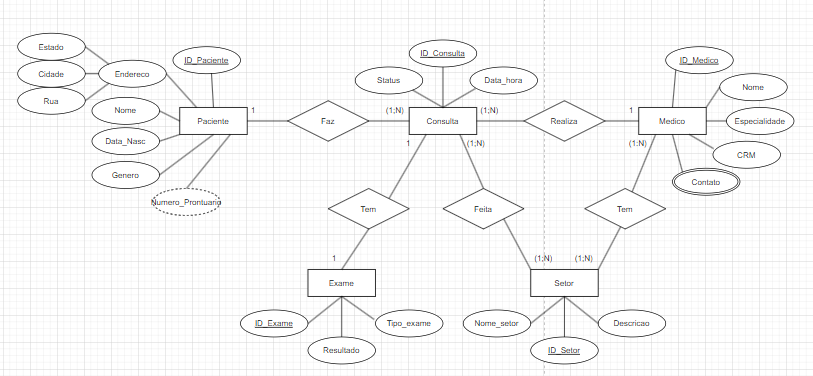
</h1>
<h2 align="center">Modelagem Lógica</h2>
<h1 align="center">
  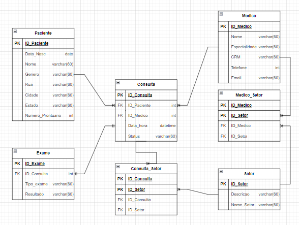
</h1>
<h2 align="center">Modelagem Física</h2>
<h1 align="center">
  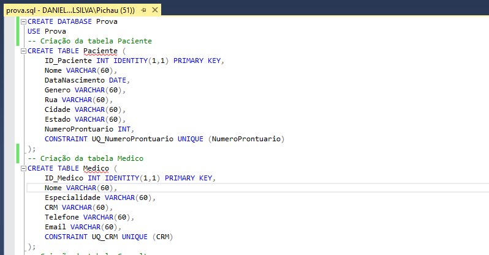
  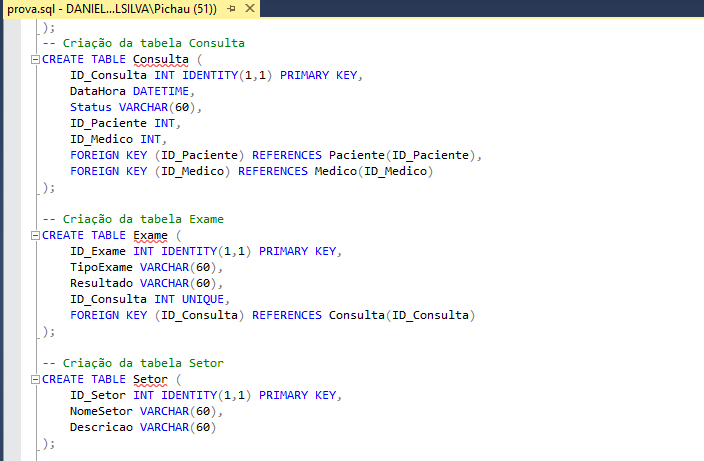
  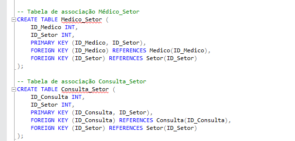
</h1>
<h2 align="center">Dados</h2>
<h1 align="center">
  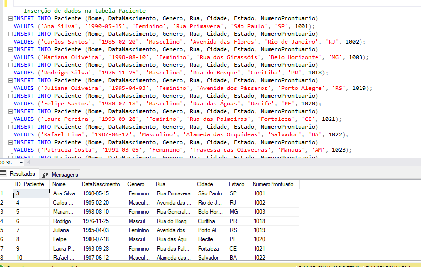
  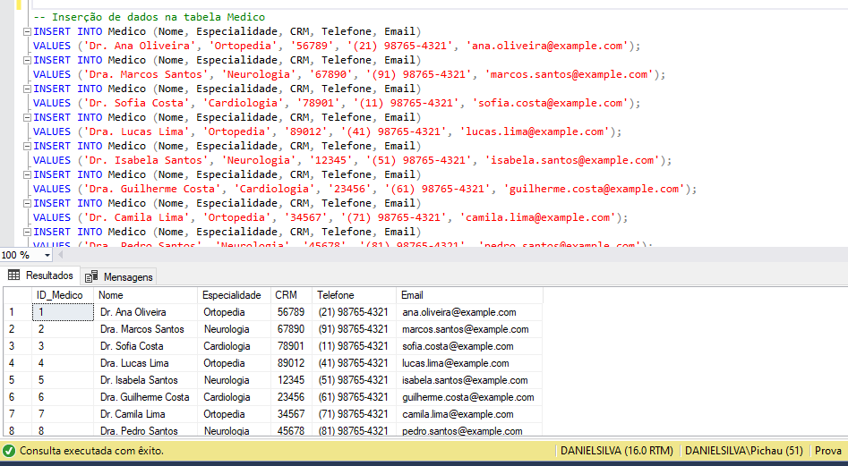
  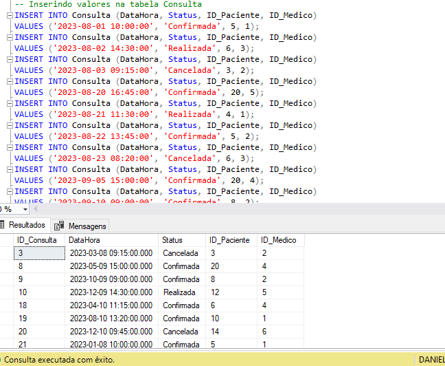
  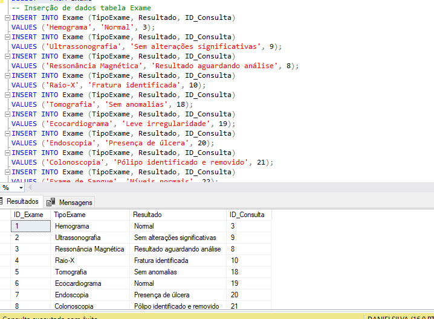
  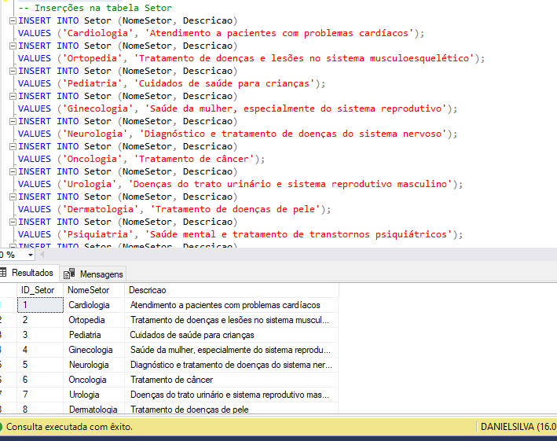
  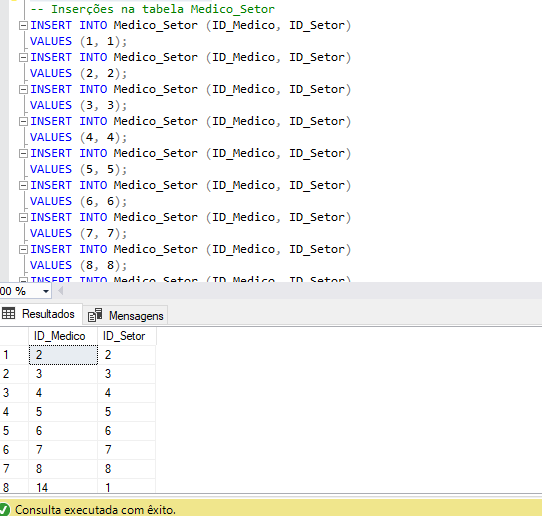
  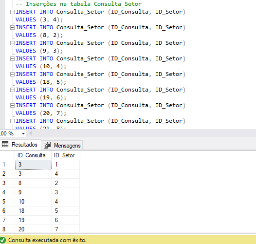
</h1>
<h2 align="center">CRUD</h2>
